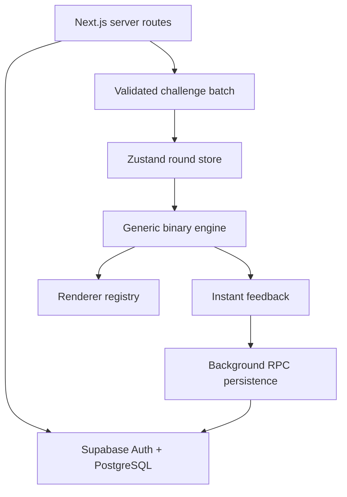

# Architecture

## System overview

Signal or Synthetic is a Next.js App Router application with a small
client-side game core and Supabase as the system of record.



Server components authenticate users, fetch validated challenge rows, and create
sessions. Client components own only the time-sensitive round interaction.
Database functions verify ownership and update related aggregates atomically.

## Boundaries

| Layer            | Responsibilities                                         | Must not own            |
| ---------------- | -------------------------------------------------------- | ----------------------- |
| `src/app`        | Routing, layouts, server composition, route protection   | Scoring rules           |
| `src/components` | Shared visual primitives and navigation                  | Data access             |
| `src/features`   | Auth UI, game engine/store/renderers, analytics views    | Service-role operations |
| `src/config`     | Mechanics, labels, XP, animation, and UI constants       | User/session state      |
| `src/services`   | Supabase queries and persistence calls                   | Presentation            |
| `src/lib`        | Environment, Supabase clients, general utilities         | Product behavior        |
| `scripts`        | Offline preparation, validation, seeding, Storage upload | Runtime game UI         |
| `supabase`       | Integrity, ownership, aggregate updates, RLS             | Client animation state  |

## Persistent versus transient state

Persistent state belongs in PostgreSQL:

- Account profile
- Category and challenge catalog
- Game session lifecycle
- Immutable question-attempt facts
- XP history and derived user statistics
- Daily streaks and analytics snapshots

Transient state belongs in the Zustand store:

- Current batch and question index
- Round status
- Question start timestamp
- Current score and combo
- Answer resolutions needed for the current completion view

This separation prevents every pointer movement or visual transition from
becoming a database write. Reloading can discard an unfinished visual state;
accepted attempts and completed-session aggregates remain durable.

## Instant answer resolution

`resolveAnswer` is a deterministic, synchronous client function. It receives a
validated challenge, selected option, response time, and current combo, then
returns:

- Correctness and the correct option
- Rounded response time
- Points obtainable at answer time
- Points awarded
- Combo before and after

The Zustand store applies that resolution immediately. The answer locks and
feedback appears without a network round trip. `record_attempt` persists the
same facts in the background through a security-definer PostgreSQL function
that validates session ownership, challenge eligibility, and value bounds.
`complete_game_session` then calculates final XP and aggregate statistics
atomically.

The server is authoritative for ownership and durable aggregates. The MVP does
not claim cheat-resistant competitive scoring; a future ranked mode would move
point calculation to an authoritative server event path.

## Challenge batching

The protected play route requests a bounded challenge batch rather than loading
the entire catalog. The current fixed 12-question Arcade round is assembled
server-side before interaction, so moving between questions requires no fetch.
For longer future rounds, the same service can return a first playable subset,
request another authenticated batch in the background when the local queue
crosses a configured threshold, exclude already seen IDs, validate the response
with `challengeSchema`, and append it to the store.

Keeping batch selection behind `getChallengeBatch` means that adaptive
difficulty, classroom sets, and category weighting can change without changing
the renderer or scoring engine. A production expansion should perform random
selection in PostgreSQL or from precomputed pools; the small starter catalog is
shuffled after a bounded query.

## Unified challenge model

The model uses a discriminated payload union:

- `kind: "image"` with source, dimensions, and accessible alt text
- `kind: "email"` with inert plain-text sender, subject, and body fields
- `kind: "audio"` with source, optional transcript, and duration

All records share binary option identifiers, display labels, difficulty,
explanation, provenance, hash, active state, and metadata. Zod cross-checks that
the category, content type, and payload kind agree.

The engine never branches on category. The category only selects labels,
learning copy, icon/accent, and a renderer.

## Renderer registration

`ChallengeRenderer` looks up the category in a typed renderer map:

```text
image -> ImageRenderer
email -> EmailRenderer
voice -> AudioRenderer
```

To add a future media type:

1. Add its category configuration and option labels.
2. Add its payload schema to the discriminated union.
3. Implement a renderer that accepts a validated challenge.
4. Register the renderer key.
5. Add database content-type validation, ingestion support, and test fixtures.

Scoring, attempts, sessions, XP, and completion stay unchanged because they only
use binary option IDs and shared challenge metadata.

## Configuration-driven mechanics

- `game.ts`: modes, question counts, and response cap
- `scoring.ts`: base points, time decay, minimum factor, combo steps
- `difficulty.ts`: tier score/XP multipliers and target response times
- `xp.ts`: answer/session/bonus XP and level curve
- `animation.ts`: restrained transition durations and easing
- `ui.ts`: product name and shell constants
- `categories.ts`: labels, renderer keys, descriptions, icons, accents

Unit tests assert monotonic and range invariants so a configuration edit fails
early instead of silently breaking scoring.

## Supabase architecture

The normalized schema uses:

- `profiles` and `user_stats` for the account shell
- `categories` and `challenges` for the active catalog
- `game_sessions` and `question_attempts` for gameplay facts
- `analytics_snapshots` for materialized historical summaries
- `xp_history` for an auditable progression ledger
- `daily_streaks` for calendar-level activity

An `auth.users` trigger creates the profile and user stats. The first completed
session creates the first daily-streak row. All user-owned tables use RLS with
`auth.uid()`. Authenticated users can read active categories and challenges,
but only secure functions create attempts or finalize a session. The
service-role ingestion script is server-only.

Media is bundled locally for a reliable MVP. The ingestion command can upload
the same hashed files to the private `challenge-media` bucket and records the
object path in metadata. A future media-source adapter can issue signed URLs
without changing challenge records or renderers.

## Authentication flow

The proxy refreshes Supabase cookies on requests. Protected layouts call
`auth.getUser()` server-side and redirect unauthenticated requests to sign-in
with a sanitized local `next` path. Auth actions validate inputs with Zod.
Supabase sends confirmation links to `/auth/callback`, which exchanges the code
and restores the intended destination. Missing environment variables produce a
configuration message rather than a false logged-in state.

## Future multiplayer

The existing session and attempt facts remain valid for multiplayer. A later
phase can add:

- `matches` and `match_members`
- A nullable `match_id` on `game_sessions`
- Server-issued round seeds or ordered challenge sets
- Supabase Realtime presence and answer events
- A server-authoritative clock and score calculation for ranked play

Each player can retain an ordinary `game_session`; the match coordinates shared
timing and compares completed sessions.

## Future leaderboards

Leaderboards should read completed sessions or a dedicated, refreshed aggregate
view. They should expose only display name, approved avatar metadata, score,
mode, and rank—not private attempt or account data. Indexes on completed
sessions, scores, user IDs, and completion timestamps support these queries.
Seasonal leaderboards can be added as a view or snapshot table without changing
attempt writes.

## Failure behavior

- No Supabase configuration: public routes render; auth and protected routes
  show setup-aware errors.
- No active challenges: the play page shows an actionable empty state.
- Attempt persistence failure: the local round remains playable and the UI
  reports that progress may not save.
- Invalid dataset rows or hash mismatches: ingestion stops before any writes.
- Partial seed failure: idempotent upserts allow a safe retry.
