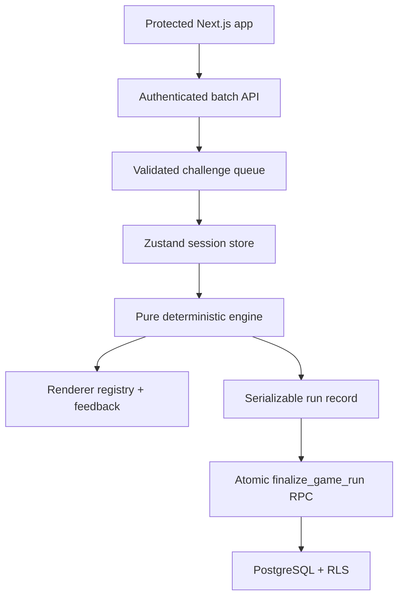

# Architecture

## System overview

Signal or Synthetic is a Next.js App Router application with a small
client-side game core and Supabase as the system of record.



Server components authenticate users. A private route handler returns bounded,
validated challenge batches. Client components own the time-sensitive
interaction, while the pure engine owns every state transition. On completion,
one database function verifies and commits the complete session atomically.

## Boundaries

| Layer            | Responsibilities                                         | Must not own            |
| ---------------- | -------------------------------------------------------- | ----------------------- |
| `src/app`        | Routing, layouts, server composition, route protection   | Scoring rules           |
| `src/components` | Shared visual primitives and navigation                  | Data access             |
| `src/features`   | Auth UI, game engine/store/renderers, analytics views    | Service-role operations |
| `src/config`     | Mechanics, labels, XP, animation, and UI constants       | User/session state      |
| `src/services`   | Supabase queries and persistence calls                   | Presentation            |
| `src/lib`        | Environment, Supabase clients, general utilities         | Product behavior        |
| `scripts`        | Offline preparation, validation, seeding, Storage upload | Runtime game UI         |
| `supabase`       | Integrity, ownership, aggregate updates, RLS             | Client animation state  |

## Persistent versus transient state

Persistent state belongs in PostgreSQL:

- Account profile
- Category and challenge catalog
- Game session lifecycle
- Immutable question-attempt facts
- XP history and derived user statistics
- Daily streaks and analytics snapshots

Serializable session state belongs in the Zustand store and a versioned
`sessionStorage` snapshot:

- Queue, current challenge, used IDs, and challenge cycle
- Lifecycle (`loading`, `playing`, `feedback`, `paused`, `completed`, `error`)
- Monotonic question timing and paused elapsed time
- Score, combo, lives, attempts, run ID, enabled categories, and shuffle seed

Network request IDs, batch errors, save state, and save confirmations remain
transient store fields and are not part of the engine snapshot.

This separation prevents visual ticks from becoming store or database writes.
Before reload, an active question is snapshotted as paused; hydration validates
the serialized state and requires an explicit resume. Stale fetch responses and
duplicate answers are ignored by lifecycle and request-ID guards.

## Instant answer resolution

`resolveAnswer` is deterministic, synchronous, and UI-independent. It receives
a validated challenge, selected option, monotonic response time, combo, lives,
and question number, then returns:

- Correctness and the correct option
- Rounded, bounded response time and timeout state
- Points obtainable at answer time
- Points awarded
- Combo before/after and multiplier
- Lives before/after
- A complete timing/difficulty snapshot

The scoring curve is category-specific. A full-score plateau is followed by:

`max(0, M - alpha × (t - tp)^beta)`

where `M`, plateau `tp`, `alpha`, `beta`, and the time limit come from category
and progression configuration. Arcade multiplies correct awards at combo
thresholds of 3, 6, and 10. Training uses the same resolution path but does not
emphasize score.

The store applies the resolution immediately. On completion,
`finalize_game_run` locks the user/run key, detects duplicate retries, reloads
the challenge answers, recomputes the configured timing curve and score, checks
combo continuity and Arcade lives, inserts the session and attempts, then
updates XP, streaks, high score, category accuracy, and user stats in the same
transaction.

### Client answer-secrecy tradeoff

Validated batch responses include `correctChoice`. This enables instant
feedback, deterministic offline-in-the-moment transitions, and safe run
serialization without one request per answer. It also means a motivated player
can inspect the browser payload. Server recomputation prevents arbitrary totals
from being persisted, but it cannot make exposed answers secret. The current
mode is educational and unranked; ranked play must keep answers server-side and
use a server-authoritative clock.

## Challenge batching

Arcade and Training request 15 challenges initially. When fewer than five
remain queued, the client requests 12 more through `/api/challenges`, excluding
the current challenge, queued rows, and IDs seen in the active cycle. Every
response is authenticated and validated with `challengeSchema`. An
`AbortController` cancels irrelevant work, and request IDs prevent stale
responses from mutating a newer run.

When a selected finite pool is exhausted, a new cycle may reuse content while
still preventing immediate or within-cycle duplicates. This lets Training
continue indefinitely and lets Arcade remain life-bounded even with a small
dataset.

Keeping batch selection behind `getChallengeBatch` means that adaptive
difficulty, classroom sets, and category weighting can change without changing
the renderer or scoring engine. A production expansion should perform random
selection in PostgreSQL or from precomputed pools; the small starter catalog is
shuffled after a bounded query.

## Unified challenge model

The model uses a discriminated payload union:

- `kind: "image"` with source, dimensions, and accessible alt text
- `kind: "email"` with inert plain-text sender, subject, and body fields
- `kind: "audio"` with source, optional transcript, and duration

All records share binary option identifiers, display labels, difficulty,
explanation, provenance, hash, active state, and metadata. Zod cross-checks that
the category, content type, and payload kind agree.

The engine never branches on category. The category only selects labels,
learning copy, icon/accent, and a renderer.

## Renderer registration

`ChallengeRenderer` looks up the category in a typed renderer map:

```text
image -> ImageRenderer
email -> EmailRenderer
voice -> AudioRenderer
```

To add a future media type:

1. Add its category configuration and option labels.
2. Add its payload schema to the discriminated union.
3. Implement a renderer that accepts a validated challenge.
4. Register the renderer key.
5. Add database content-type validation, ingestion support, and test fixtures.

Scoring, attempts, sessions, XP, and completion stay unchanged because they only
use binary option IDs and shared challenge metadata.

## Configuration-driven mechanics

- `game.ts`: modes, lives, batches, feedback timing, storage keys, response cap
- `scoring.ts`: base points and exact combo steps
- `difficulty.ts`: source tiers plus question-count progression steps
- `xp.ts`: answer/session/bonus XP and level curve
- `animation.ts`: restrained transition durations and easing
- `ui.ts`: product name and shell constants
- `categories.ts`: labels, renderers, visuals, plateaus, limits, decay exponents

Unit tests assert monotonic and range invariants so a configuration edit fails
early instead of silently breaking scoring.

## Supabase architecture

The normalized schema uses:

- `profiles` and `user_stats` for the account shell
- `categories` and `challenges` for the active catalog
- `game_sessions` and `question_attempts` for gameplay facts
- `analytics_snapshots` for materialized historical summaries
- `xp_history` for an auditable progression ledger
- `daily_streaks` for calendar-level activity

An `auth.users` trigger creates the profile and user stats. The first non-empty
completed session creates the first daily-streak row. All user-owned tables use
RLS with `auth.uid()`. Authenticated users can read active categories and
challenges, but only secure functions create attempts or finalize a session.
`client_run_id` is unique per user, making completion retries idempotent. The
service-role ingestion script is server-only.

Media is bundled locally for a reliable MVP. The ingestion command can upload
the same hashed files to the private `challenge-media` bucket and records the
object path in metadata. A future media-source adapter can issue signed URLs
without changing challenge records or renderers.

## Authentication flow

The proxy refreshes Supabase cookies on requests. Protected layouts call
`auth.getUser()` server-side and redirect unauthenticated requests to sign-in
with a sanitized local `next` path. Auth actions validate inputs with Zod.
Supabase sends confirmation links to `/auth/callback`, which exchanges the code
and restores the intended destination. Missing environment variables produce a
configuration message rather than a false logged-in state.

## Future multiplayer

The existing session and attempt facts remain valid for multiplayer. A later
phase can add:

- `matches` and `match_members`
- A nullable `match_id` on `game_sessions`
- Server-issued round seeds or ordered challenge sets
- Supabase Realtime presence and answer events
- A server-authoritative clock and score calculation for ranked play

Each player can retain an ordinary `game_session`; the match coordinates shared
timing and compares completed sessions.

## Future leaderboards

Leaderboards should read completed sessions or a dedicated, refreshed aggregate
view. They should expose only display name, approved avatar metadata, score,
mode, and rank—not private attempt or account data. Indexes on completed
sessions, scores, user IDs, and completion timestamps support these queries.
Seasonal leaderboards can be added as a view or snapshot table without changing
attempt writes.

## Failure behavior

- No Supabase configuration: public routes render; auth and protected routes
  show setup-aware errors.
- No active challenges: setup reports an actionable batch error.
- Batch failure: queued play continues; an empty queue exposes a retry state.
- Completion persistence failure: the finished local record remains available
  and the game-over screen exposes an idempotent retry.
- Refresh during play: the validated run restores paused without resubmitting an
  answer.
- Invalid dataset rows or hash mismatches: ingestion stops before any writes.
- Partial seed failure: idempotent upserts allow a safe retry.
