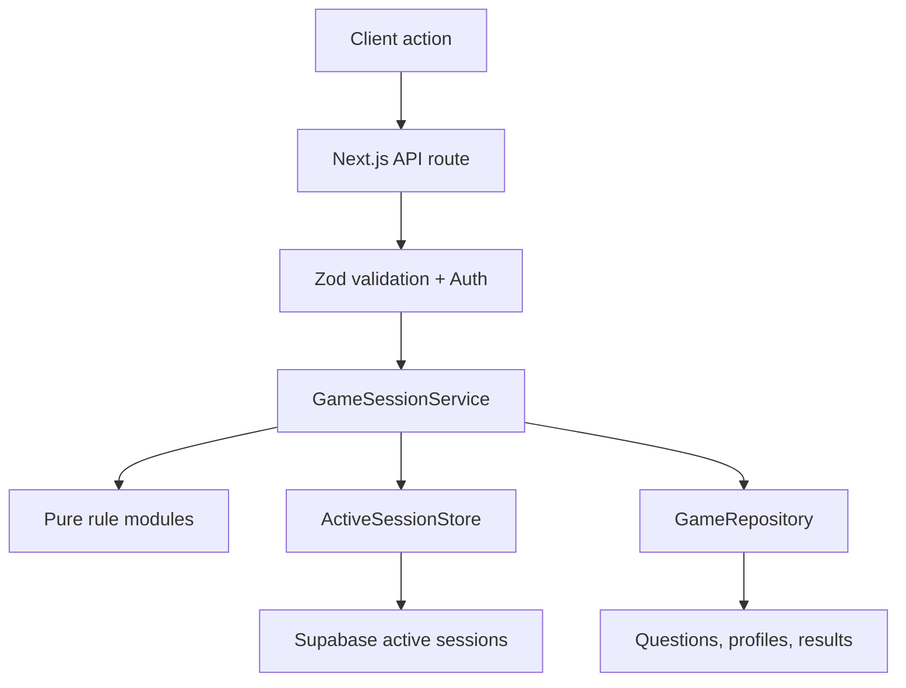

# Server architecture and decisions

## Runtime flow



The route translates HTTP into a typed command. `GameSessionService` coordinates
the use case. Pure modules calculate the answer result. Adapters perform I/O.

## Why TypeScript

The UI, API, engine, and database mapping all exchange structured data. One
TypeScript contract catches mismatches such as `challengeId` versus
`questionId` during development instead of during a live demo.

TypeScript does not validate network input at runtime, so Zod validates:

- request bodies and URL parameters,
- gameplay configuration loaded from JSONB,
- database question metadata,
- active-session JSON loaded from Supabase.

## Why pure rule modules

`scoring.ts`, `combo.ts`, `lives.ts`, `difficulty.ts`, `xp.ts`, and
`answer-evaluator.ts` do not import React, Next.js, Supabase, or HTTP objects.

This gives three benefits:

1. Rules are fast and deterministic to test.
2. Hosting/database changes cannot silently change game balance.
3. A future CLI, mobile client, or simulation can reuse the same engine.

## Why one session service

`GameSessionService` is the authoritative coordinator. It:

- authenticates ownership through the user ID supplied by the route,
- loads and snapshots the active configuration,
- chooses questions,
- records the server start time,
- rejects stale question IDs,
- evaluates private answers,
- applies rules,
- persists session state,
- completes progression and analytics records.

This prevents rules from being scattered through route handlers.

## Private and public challenge types

`QuestionRecord` contains `isAi` and `explanationText`.
`PublicQuestion` does not contain either during normal play.

The mapper is a deliberate security boundary:

```text
QuestionRecord -> toPublicQuestion() -> PublicQuestion
```

Training explanations are returned only after the answer is evaluated.

## Server-measured time

The client can animate a timer, but the server stores
`challengeStartedAtMs` and calculates response time when the answer arrives.
The client cannot claim a faster answer.

Network latency is included. For a hackathon this is the safest simple rule. A
future version could compensate for measured round-trip latency with signed
timestamps, but that increases complexity and creates more anti-cheat edge
cases.

## Scoring model

The engine implements the supplied Plateau + Exponential Ease-In model:

```text
effective plateau = tier plateau + category grace

full points, when response <= effective plateau
decayed points, after the plateau
zero points, after the Arcade hard timer

awarded points = decayed points × combo multiplier
```

The multiplier uses the combo that existed before the current answer. Therefore
the first correct answer is `1x`, and a streak earns larger multipliers on later
answers.

Training disables score, combo, lives, and the hard timer.

## Configuration snapshot

At game start the server loads the active `game_config` and places a snapshot in
the active session.

Why snapshot it?

- A configuration change cannot alter a run halfway through.
- Every attempt in the run uses the same balance version.
- The UI receives the same timer values the server enforces.

## Repository pattern

`GameRepository` expresses what the engine needs without mentioning Supabase.

- `MockGameRepository` runs instantly and makes team integration easy.
- `SupabaseGameRepository` maps Postgres/Supabase rows into domain types.

Only `src/database/supabase` uses snake_case. The rest of the application uses
camelCase.

## Durable active sessions

The original in-memory session map is retained only for mock development.
Production uses `active_game_sessions`.

The table stores:

- authoritative state,
- private current question,
- configuration snapshot,
- attempt accumulator,
- expiry,
- optimistic version.

Each answer updates only when the stored version matches the version read. If
two duplicate requests arrive together, one succeeds and the other gets HTTP 409. This is a compare-and-swap operation.

## Atomic completion

`persist_completed_game` performs, in one database transaction:

- idempotency check by session UUID,
- session insert,
- private answer verification,
- attempt inserts,
- XP update,
- level calculation,
- streak update.

If a statement fails, Postgres rolls back the entire transaction. Replaying the
same completed session cannot add XP twice.

## Authentication choice

The API accepts a Supabase access token as `Authorization: Bearer ...`.
`getUser(token)` performs a server-side Auth request and returns an authentic
user identity.

This is simpler to integrate with any UI framework than coupling the engine to
a particular cookie layout.

## Azure decision

Supabase remains the data/auth provider; Azure hosts the Next.js server.
The Dockerfile uses Next.js standalone output so the runtime image contains
only traced production files.

Azure App Service for Containers is preferred over Azure Static Web Apps here
because this is an API-heavy full-stack application and Static Web Apps hybrid
Next.js support remains a preview service.

## File responsibility map

| Location                  | Responsibility                               |
| ------------------------- | -------------------------------------------- |
| `src/app/api`             | HTTP routes only                             |
| `src/server/game`         | Authoritative game behavior                  |
| `src/server/sessions`     | Session persistence interface and validation |
| `src/server/repositories` | Database boundary                            |
| `src/server/auth`         | Identity verification                        |
| `src/server/analytics`    | Analytics use case                           |
| `src/server/leaderboard`  | Leaderboard use case                         |
| `src/database/mock`       | Local/test adapter                           |
| `src/database/supabase`   | Production adapter                           |
| `src/shared`              | UI/server contracts                          |
| `src/config`              | Environment and default balance              |
| `supabase/migrations`     | Version-controlled database changes          |
| `tests/server`            | Rule/session verification                    |
